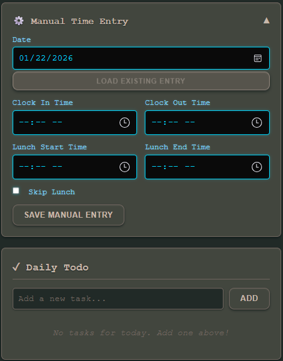

# TimeSheet - Time Tracking Application

A standalone time tracking application that runs directly in your web browser - perfect for tracking work hours Monday through Friday with lunch break support.

## Features

- ⏰ Clock in/out functionality (Monday-Friday only)
- 🍽️ Lunch break tracking (start/end lunch or skip lunch)
- 📊 Daily hours tracking
- 📈 Weekly hours summary
- 💾 Automatic data persistence (stored in browser's localStorage)
- 📝 Daily Todo list
- 📋 Side menu showing hours worked each day
- ✏️ Manual time entry for retroactive logging

## Live Demo

Visit the [GitHub Pages site](https://rocketsloth.github.io/TimeSheet/) to use the application.

## Screenshots

### Main Interface

*The main TimeSheet interface showing clock-in status, daily/weekly hours, and daily todo list*

### Manual Time Entry

*Manual time entry section for retroactive time logging*

## How to Use

1. **Clock In**: Click "Clock In" when you start work (only works Monday-Friday)
2. **Lunch Options**:
   - **Start Lunch**: Click when you go to lunch
   - **End Lunch**: Click when you return from lunch
   - **Skip Lunch**: Click if you're not taking a lunch break
3. **Clock Out**: Click when you finish work
4. **Manual Entry**: Use the "Manual Time Entry" section to enter times retroactively
5. **Todos**: Add daily tasks in the "Daily Todo" section

Your hours are automatically calculated and displayed:
- **Today's Hours**: Shows total hours worked today (excluding lunch time)
- **Week's Hours**: Shows total hours worked this week (Monday-Friday)

## Data Storage

Your time tracking data and todos are stored in your browser's localStorage. This means:
- ✅ Data persists even after closing the browser
- ✅ Data is stored locally on your computer
- ⚠️ If you clear your browser data, you'll lose your timesheet records
- ⚠️ Data is specific to the browser you use

## Setup for GitHub Pages

1. Create a new repository on GitHub
2. Upload `index.html` (or rename `timesheet.html` to `index.html`)
3. Go to repository Settings → Pages
4. Select the branch (usually `main` or `master`)
5. Select the folder (usually `/root`)
6. Click Save
7. Your site will be available at `https://rocketsloth.github.io/TimeSheet/`

## Local Usage

Simply open `index.html` (or `timesheet.html`) in your web browser - no installation required!

## Technologies

- Pure HTML, CSS, and JavaScript
- No dependencies
- No build process required
- Works offline

## License

MIT License - feel free to use and modify as needed.
